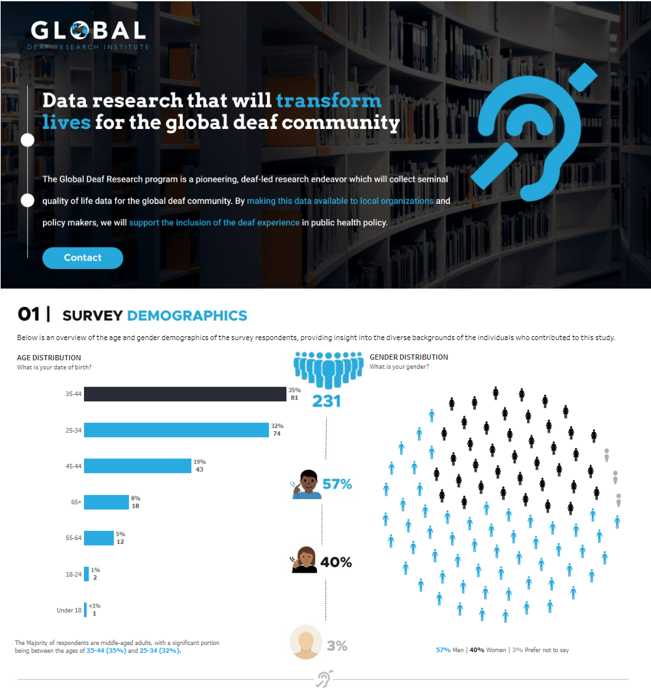
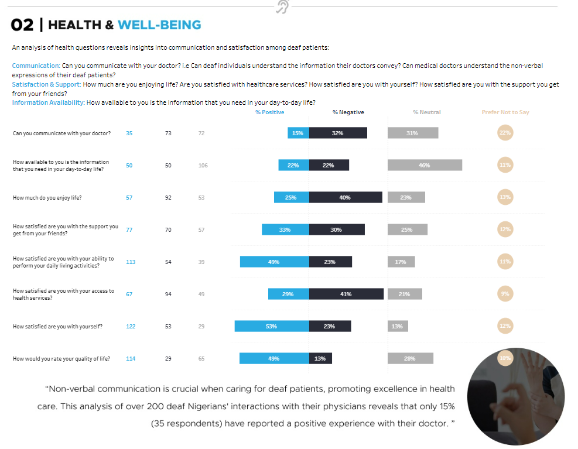
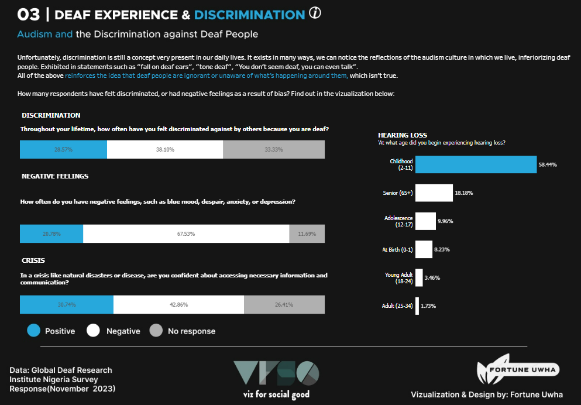

# Viz for Social Good Visualisation Project: A Global Deaf Reseacrch Survey Analysis Dashboard
An interactive dashboard in Tableau in association with Viz for Social Good
## Table of Contents

- [Project Overview](#project-overview)
- [Dependencies](#dependencies)
- [Data](#data)
- [Dashboard](#dashboard)
- [Usage](#usage)
- [Contributing](#contributing)
- [License](#license)

## Project Overview📖

The goal of this project is to provide insights and visualizations based on the Data Survey data provided by the GDRI team.  The main goal of this research was to refine and implement our quality of life assessment tool, which incorporates the quality of life assessment tool disseminated by the World Health Organization, Quality of Life Brief Version (WHOQOL-BREF), with additional tailored questions focusing on barriers and accessibility.  

## Dependencies

The project relies on the following dependencies:

- Python 3
- Pandas
- Numpy

## Data

The dataset used in this project is gotten from the official website of viz for social Good.The team segmented the country into six regions (Northeast, North, Northwest, Southeast, South, Southwest) and travelled to each of the six, spending a total of 20 days administering the survey to 225 deaf Nigerians, with nearly balanced gender participation of 133 male and 92 female participants, in partnership with the organization Deaf Worlds and Nigeria National Association of the Deaf. Our approach is consultative, inclusive, and participatory in data gathering.  You can get the dataset [here](https://www.vizforsocialgood.com/join-a-project/2024/global-deaf-research-institute).

Once you have the dataset, update the file path in the project script or notebook accordingly.

## Dashboard
### Data Survey Visualisation Result:

### Part one: Survey Demographics

### Part two: Health and wellbeing

### Part three: Deaf experience and Discrimination

## Usage
To interact with the visualisation, please view the dashboard hosted on [Tableau public](https://public.tableau.com/app/profile/fortune.uwha/viz/GDRIDataSurveyfortheDeafCommunity/GDRIDataSurvey)

## Contributing

Contributions to this project are welcome! If you find any issues or have suggestions for improvements, feel free to open an issue or submit a pull request.

## License

This project is licensed under the [MIT License](LICENSE).

